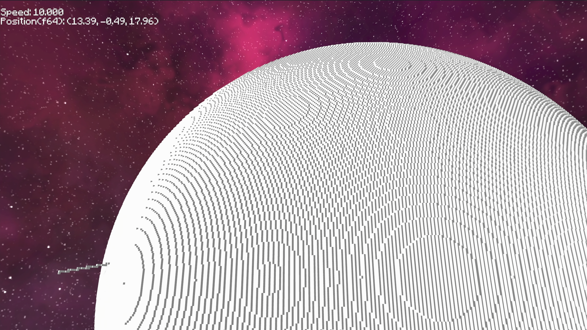

# voxel-simulation

Voxel Simulation is an experimental 3D world built with the
[Bevy](https://bevyengine.org/) game engine. The project showcases
streaming voxel terrain, high precision coordinates via the
[big_space](https://crates.io/crates/big_space) crate and various debug
tools.



## Running

Execute the following command from the repository root to compile and
launch the demo:

```bash
cargo run --release -p voxel-simulation
```

## License

Licensed under either of

 * Apache License, Version 2.0
   ([LICENSE-APACHE](LICENSE-APACHE) or http://www.apache.org/licenses/LICENSE-2.0)
 * MIT license
   ([LICENSE-MIT](LICENSE-MIT) or http://opensource.org/licenses/MIT)

at your option.

## Contribution

Unless you explicitly state otherwise, any contribution intentionally submitted
for inclusion in the work by you, as defined in the Apache-2.0 license, shall be
dual licensed as above, without any additional terms or conditions.

See [CONTRIBUTING.md](CONTRIBUTING.md).
